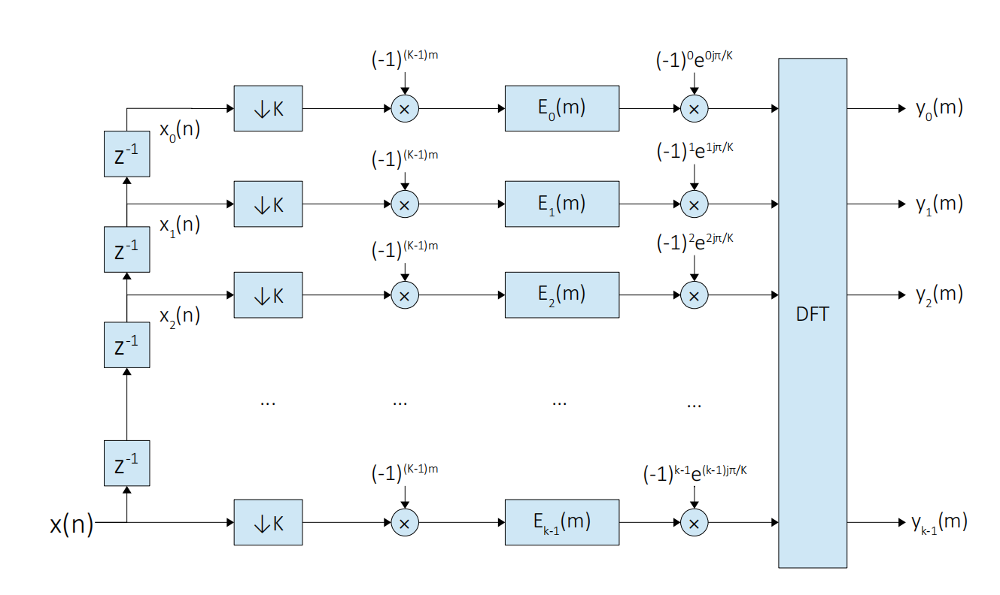
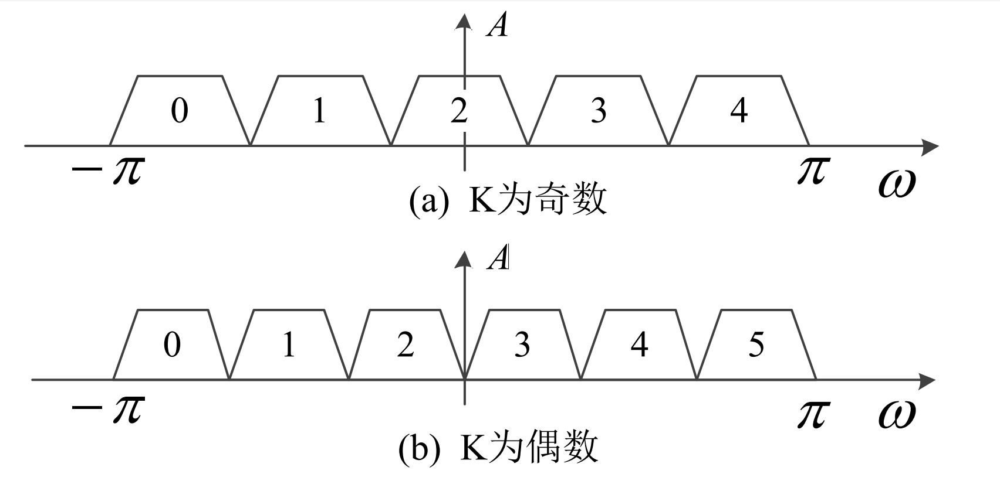

# 基于多相滤波器的数字信道化算法详解

## 概述

本文详细介绍了基于多相滤波器的数字信道化算法的推导过程, 如果您在阅读的过程中发现算法推导过程中有任何错误, 请不吝指出. 

多相滤波信道化是对传统信道化结构的改进, 通过各支路共用一个低通滤波器提高资源的利用率, 同时采用多相抽取提高了后续滤波和 FFT 的运算效率. 给定输入信号为$x(n)$, 欲划分的信道数为$K$, 原型滤波器$h(n)$
的阶数为$N$, 且滤波器阶数能被信道数整除, 即$L = N / K$, 则原型滤波器的系统函数$H(z)$可表示为:

$$
H(z) = \sum_{n = 0}^{N-1}h(n)z^{-n} \\ 
    = h_0z^{-0} + h_Kz^{-K} + ... + h_{(L-1)K}z^{-(L-1)K} \\ 
    + h_1z^{-1} + h_{K+1}z^{-(K+1)} + ... + h_{(L-1)K + 1}z^{-[(L-1)K+1]} \\ 
    ... \\
    + h_{K-1}z^{-(K-1)} + h_{2K-1}z^{-(2K-1)} + ... + h_{LK-1}z^{-(LK-1)} \\
    = z^{-0}(h_0 + h_Kz^{-K} + ... + h_{(L-1)K}z^{-(L-1)K}) \\ 
    + z^{-1}(h_1 + h_{K+1}z^{-K} + ... + h_{(L-1)K + 1}z^{-(L-1)K}) \\
    ... \\
    + z^{-(K-1)}(h_{K-1} + h_{2K-1}z^{-K} + ... + h_{LK-1}z^{-(L-1)K}) \\ 
    = \sum_{k = 0}^{K-1}(z^{-k}\sum_{l=0}^{L-1}h_{lK+k}z^{-lK}) \tag{1}
$$

令$e_r(l)=h(lK+r)$为原型滤波器$h(n)$的多相分量, 则

$$E_r(z) = \sum_{l=0}^{L-1}e_r(l)z^{-l}=\sum_{l=0}^{L-1}h(lK+r)z^{-l} \tag{2}$$

那么$H(z)$可表示为

$$ H(z) = \sum_{r = 0}^{K-1}(E_r(z^K)z^{-r} \tag{3}$$

传统数字信道化结构中, 第$k$路信道的实现框图如下图所示. 信号经过滤波后, 与复指数信号$e^{-2j\pi kn/K}$相乘, 实现正交下变频到基带信号. 其中, 滤波器$h_k(n)$的系统函数$H_k(z)$可表示为$h_k(n)=h_0(n)e^{2j\pi kn/K}$, $h_0(n)$为低通原型滤波器.

令$w_k = -2\pi k/K$,则复数乘法器的输出$v_k(n)$可表示为

$$ 
v_k(n) = [x(n) * h_k(n)]e^{jw_kn} \\
    = \sum_{i=0}^{N-1}x(n-i)[h_0(i)e^{-jw_ki}]e^{jw_kn} \\ 
    = \sum_{i=0}^{N-1}x(n-i)[h_0(i)e^{jw_k(n-i)}] \tag{4}
$$

> $*$: 卷积符号, 下同.

第$k$路的输出$y_k(m)$为

$$y_k(m) = v_k(n)|_{n=Km} = \sum_{i=0}^{N-1}x(Km-i)[h_0(i)e^{jw_k(Km-i)}] \tag{5}$$

令$i = lK+r$, 则上式可表示为

$$y_k(m) = \sum_{r=0}^{K-1}\sum_{l=0}^{L-1}x(Km-Kl-r)h_0(Kl+r)e^{jw_k(Km-Kl-r)} \tag{6}$$

令$x_r(m-l) = x(K(m-l)-r)$, 结合原型滤波器$h(n)$的多相分量$e_r(l)=h(Kl+r)$, 上式可表示为

$$
y_k(m) = \sum_{r=0}^{K-1}\sum_{l=0}^{L-1}x_r(m-l)e_r(l)e^{jw_k(Km-Kl-r)} \\ 
    = \sum_{r=0}^{K-1}e^{-jw_kr} \sum_{l=0}^{L-1}x_r(m-l)e_r(l)e^{jw_kK(m-l)}  \tag{7}
$$

$K$分别为奇数和偶数时, 信道分配采用如下图所示的方式进行排列

第 $k$ 路的中心频率 $w_k$ 为

$$ w_k = -\pi + \frac{2\pi k + \pi}{K} \tag{8}$$

将上式带入公式 (7) 得

$$y_k(m) = \sum_{r=0}^{K-1}e^{j(\pi-\frac{2\pi k + \pi}{K})r} \sum_{l=0}^{L-1}x_r(m-l)e_r(l)(-1)^{(K-1)(m-l)} \tag{9}$$

> 注: $e^{-j\pi} = -1$, $x^{ab} = (x^a)^b$ ==> $e^{-j\pi(K-1)(m-l)} = (-1)^{(K-1)(m-l)}$

令

$$
u_r(m) = \sum_{l=0}^{L-1}x_r(m-l)(-1)^{(K-1)(m-l)}e_r(l) \\
    = x_r(m)(-1)^{(K-1)m}*e_r(m) \tag{10}
$$

代入上式得

$$
y_k(m) = \sum_{r=0}^{K-1}u_r(m)e^{j(\pi-\frac{2\pi k + \pi}{K})r}\\ 
    = \sum_{r=0}^{K-1}u_r(m)e^{j\pi r}e^{-j\pi r/K}e^{-j(\frac{2\pi k}{K})r} \tag{11}
$$

> N点的DFT定义为 $X(k) = DFT[x(n)] = \sum_{n=0}^{N-1}x(n)e^{-2j\pi kn/N}$

$m_i$时刻, 各个信道的输出为
$$Y_{m_i}(k) = \{y_0(m_i), y_1(m_i), y_2(m_i), ... ,y_{K-1}(m_i) \} \tag{12}$$
$$ = DFT[u_r(m)(-1)^re^{j\pi r/K}]|_{m=m_i} $$

## 总结

以上是多相滤波数字信道化结构的推导过程. 对推导过程总结如下:

1. 对输入信号 $x(n)$ 和滤波器系数 $h_0(n)$ 进行多相分解, 即
$$x_k(m) = x(Km+k) \tag{13}$$
$$e_k(m) = h_0(Km+k) \tag{14}$$
2. 对分解后的多相信号$x_k(m)$乘以指数 $(-1)^{(K-1)m}$
3. 将上一步的输出同多相滤波器系数 $e_k(m)$ 进行卷积运算得到 $u_k(m)$, 即

$$u_k(m) = x_k(m)(-1)^{(K-1)m}*e_k(m) \tag{15}$$

4. 将 $m_i$ 时刻多相滤波器的输出 $u(k|_{m=m_i}) = u_k(m_i)$ 分别乘以复指数 $(-1)^ke^{j\pi k/K}$, 得
$$v(k|_{m=m_i}) = u(k|_{m=m_i})(-1)^ke^{j\pi k/K} \tag{16}$$
5. 对上一步得到的 $v(k|_{m=m_i})$ 作 $K$点的 DFT 得到$m_i$
时刻的输出向量 
$$Y(m_i) = DFT[v(k|_{m=m_i})] \tag{17}$$

由此得到的多相滤波信道化原理结构框图如下图所示.

