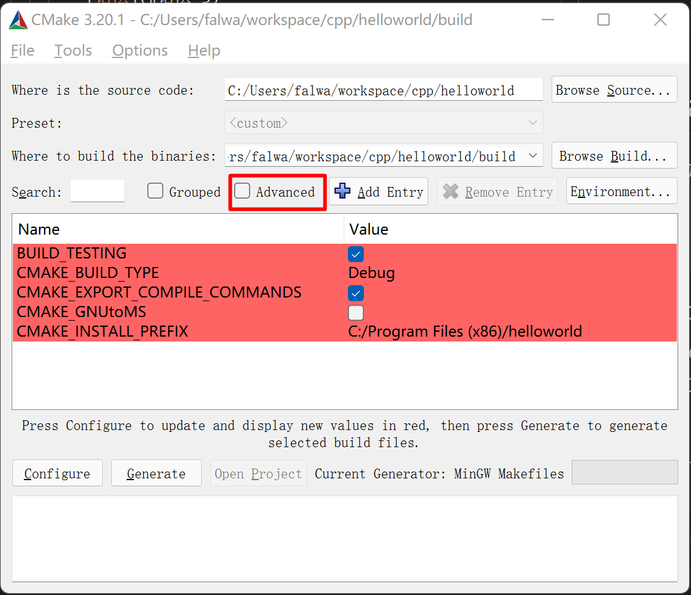

- [cmake-commands](#cmake-commands)
  - [Scripting Commands](#scripting-commands)
    - [cmake_minimum_required](#cmake_minimum_required)
    - [project](#project)
    - [include](#include)
    - [if](#if)
    - [cmake_policy](#cmake_policy)
    - [enable_language](#enable_language)
    - [mark_as_advanced](#mark_as_advanced)
    - [message](#message)
    - [set](#set)
      - [Set Normal Variable](#set-normal-variable)
      - [Set Cache Entry](#set-cache-entry)
      - [Set Environment Variable](#set-environment-variable)
  - [Project Commands](#project-commands)
    - [add_compile_definitions](#add_compile_definitions)
    - [add_definitions](#add_definitions)
    - [enable_language](#enable_language-1)
  - [CTest Commands](#ctest-commands)
  - [Deprecated Commands](#deprecated-commands)
- [cmake-variables](#cmake-variables)
  - [ENV](#env)

# cmake-commands

> 参见: 
> - [cmake-commands manual](https://cmake.org/cmake/help/v3.22/manual/cmake-commands.7.html); 安装CMake后,在本地安装目录下也能够找到[manual](file:///C:/Program Files/CMake/doc/cmake/html/index.html).

## Scripting Commands

### cmake_minimum_required

指定工程要求的CMAKE最低版本

- 语法

  `cmake_minimum_required`(`VERSION` *major.minor*\[.*patch*\[.*tweak*\]\])

- 示例

  ```cmake
  cmake_minimum_required(VERSION 2.8.11)
  ```
### project

设置工程名.

- 语法

  `project(`*ProjectName* *\[LanguageName\]*`)`

  `project(`*ProjectName* <br>
        &emsp;&emsp; \[`VERSION` *major*\[*.minor*\[*.patch*\[*.tweak*\]\]\]\] <br>
        &emsp;&emsp; \[`DESCRIPTION` *ProjectDescription*\] <br>
        &emsp;&emsp; \[`HOMEPAGE_URL` *URLString*] <br>
        &emsp;&emsp; \[`LANGUAGES` *LanguageName*...])

- 说明
  - `VERSION` : 版本号.
  - `DESCRIPTION` : 详细描述
  - `HOMEPAGE_URL` : 主页
  - `LANGUAGES` : 开发语言(CXX, )

- 示例
  ```cmake
  project(CERTI CXX)
  ```
### include

从文件或模块中加载并运行CMake代码. 

??默认的加载目录为: C:/Program Files/CMake/share/cmake-3.20/mudules.

- 语法

  `include(`*file* | *module* \[`OPTIONAL`\] <br>
    &emsp; &emsp; \[`RESULT_VARIABLE` *VariableName*\] <br>
    &emsp; &emsp; \[`NO_POLICY_SCOPE`\]`)`

- 说明
  - `OPTIONAL` : 如果文件或模块不存在, 不会产生错误.
  - `RESULT_VARIABLE` : 

```cmake
# ${CMAKE_ROOT} = C:/Program Files/CMake/share/cmake-3.20
include(${CMAKE_ROOT}/Modules/Dart.cmake)

# Load Checker macros
# 在${CMAKE_MODULE_PATH}目录下能够找到: CheckFunctionExists.cmake文件
include(CheckFunctionExists)
# 在${CMAKE_MODULE_PATH}目录下能够找到: CheckLibraryExists.cmake文件
include(CheckLibraryExists)
```

```cmake
# 以下两种写法都行
include(Dart.cmake)
include(Dart)
```

### if

- 语法
  
  `if`(\<*condition*\>) <br>
    &emsp; \<*commands*\> <br>
  `elseif`(\<*condition*\>) <font color="forestgreen"># optional block, can be repeated</font> <br>
    &emsp; \<*commands*\> <br>
  `else()`             <font color="forestgreen"># optional block</font> <br>
    &emsp; \<*commands*\><br>
  `endif()`

- 示例
  ```cmake
  # New Policy for full path library search
  # see cmake --help-policy CMP0003
  if(COMMAND CMAKE_POLICY)
    cmake_policy(SET CMP0003 NEW)
  endif(COMMAND CMAKE_POLICY)

  # Display some information on host and target (when cross-compiling)
  if (CMAKE_CROSSCOMPILING)
    message(STATUS "Cross-compiling build.")
  else (CMAKE_CROSSCOMPILING)
    message(STATUS "Native build.")
  endif (CMAKE_CROSSCOMPILING)

  # Test 32/64 bits
  if("${CMAKE_SIZEOF_VOID_P}" EQUAL "8")
    ...
  endif()

  # Test Endianess
  include(TestBigEndian)
  TEST_BIG_ENDIAN(BIG_ENDIAN)
  if(BIG_ENDIAN)
    ...
  endif(BIG_ENDIAN)

  if (NOT BUILD_LEGACY_LIBRTI AND WIN32)
   ...
  endif()

  if (CMAKE_VERSION VERSION_LESS 3.1.3)
  endif()

  if("${CMAKE_C_COMPILER}" MATCHES "clang.*")
  endif()

  IF ("${CMAKE_BINARY_DIR}" STREQUAL "${CMAKE_SOURCE_DIR}")
  endif()
  ```


### cmake_policy

```cmake
if(COMMAND CMAKE_POLICY)
  cmake_policy(SET CMP0003 NEW)
endif(COMMAND CMAKE_POLICY)
```

### enable_language

```cmake
enable_language(C)
```

### mark_as_advanced

标记此变量为高级, 在`cmake-gui`中, 当勾选`Advanced`选项时, 才会显示.
在脚本模式下, 此标记无作用.



- 语法

  `mark_as_advanced`(\[`CLEAR`|`FORCE`\] \<*var1*\> ...)

- 示例

  ```cmake
  # TCL_TCLSH ??
  mark_as_advanced(TCL_TCLSH DART_ROOT)
  ```
### message

记录消息.

- 语法

  - 常规消息
  
    `message`(\[\<*mode*\>\] "*message text*" ...)

  - Reporting checks

    `message`(\<*checkState*\> "*message text*" ...)

- 说明
  - mode
    - FATAL_ERROR : 致命错误. 停止处理和生成.
    - SEND_ERROR : 错误. 继续处理,但不生成.
    - WARNING : 警告. 可以继续向下处理.
    - NOTICE : 打印到stderr的重要消息, 以引起用户的注意. 省略`mode`时,为此.
    - STATUS : 状态.
    - VERBOSE : 冗余. 
    - DEBUG : 调试.
    - TRACE : 跟踪.

- 示例
  ```cmake
  # Display some information on host and target (when cross-compiling)
  if (CMAKE_CROSSCOMPILING)
    message(STATUS "Cross-compiling build.")
  else (CMAKE_CROSSCOMPILING)
    message(STATUS "Native build.")
  endif (CMAKE_CROSSCOMPILING)
  ```

### set

给普通变量、缓存变量或环境变量赋值.

#### Set Normal Variable

- 语法
  `set`(\<*variable*\> \<*value*\>... [`PARENT_SCOPE`])

- 示例
  ```cmake
  # Use CERTI specific CMake modules first
  set(CMAKE_MODULE_PATH ${PROJECT_SOURCE_DIR}/scripts)

  SET(PACKAGE_NAME      "CERTI")
  SET(PACKAGE_VERSION_MAJOR "4")
  SET(PACKAGE_VERSION_MINOR "0")
  SET(PACKAGE_VERSION_PATCH "0")
  SET(PACKAGE_VERSION   "${PACKAGE_VERSION_MAJOR}.${PACKAGE_VERSION_MINOR}.${PACKAGE_VERSION_PATCH}")
  ```
#### Set Cache Entry

#### Set Environment Variable


## Project Commands

### add_compile_definitions

将预处理宏定义添加到源文件的编译命令中.

- 语法
  
  `add_compile_definitions`(\<*definition*\> ...)

- 示例

  ```cmake
  add_compile_definitions(FOO BAR)
  # 等价于 add_definitions(-DFOO -DBAR)
  ```

### add_definitions

添加预处理宏定义. 建议使用`add_compile_definitions`替代.

- 语法
  
  `add_definitions(-D`FOO `-D`BAR ...)

  生成如下命令:

  `....g++.exe -DFOO -DBAR -g -o ....main.cpp.obj -c ...\\main.cpp`
### enable_language

在 CMake 中启用对某种语言的支持, 如: CXX, C, CUDA, OBJC, OBJCXX, Fortran, HIP, ISPC, and ASM.

- 语法
  
  `enable_language`(\<*lang*\> \[`OPTIONAL`\])
- 示例: 
  ```cmake
  enable_language(C)
  ```
> 参见: [enable_language](https://cmake.org/cmake/help/v3.22/command/enable_language.html)

## CTest Commands

## Deprecated Commands

# cmake-variables

## ENV

读取环境变量的操作符.

$ENV{VAR}

```cmake
读取PATH
message($ENV{PATH})
```

```cmake
# 判断 变量环境变量PATH是否存在
if(DEFINED ENV{PATH})
```