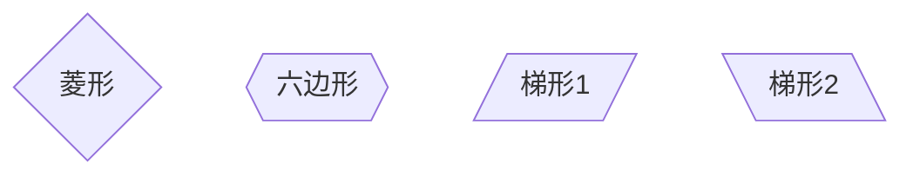
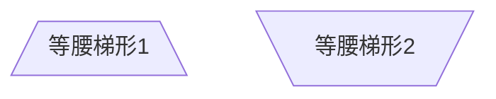
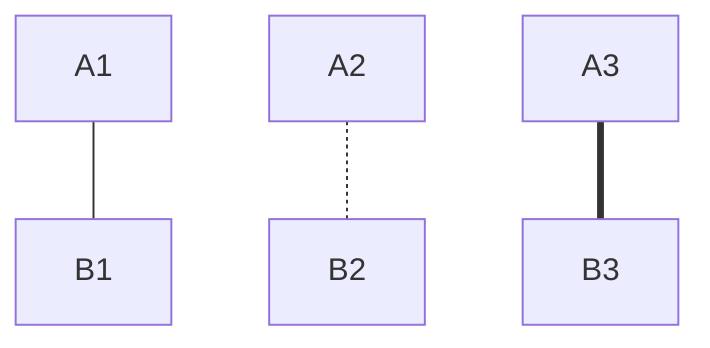
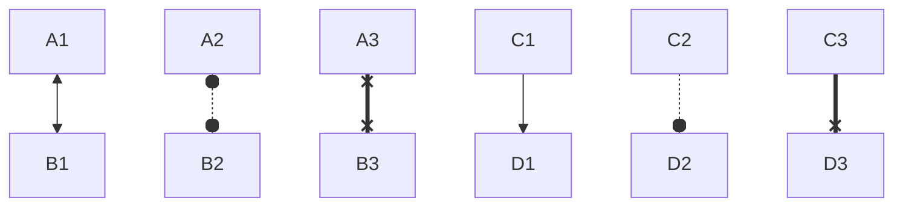
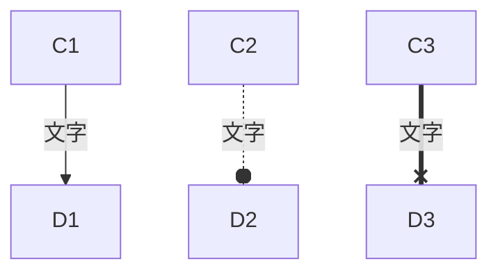
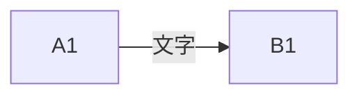
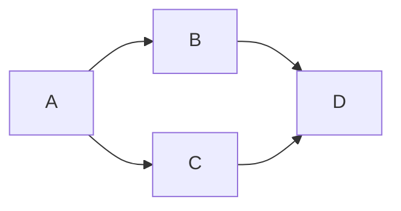
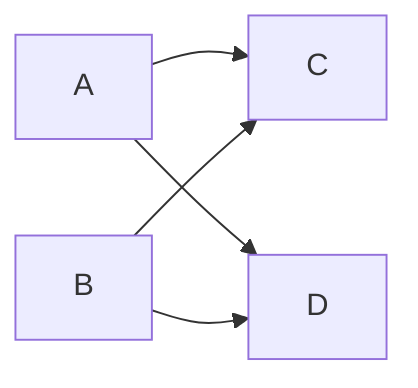
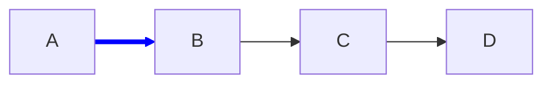

# 流程图(flowchart)

**目录**

- [流程图(flowchart)](#流程图flowchart)
- [基础](#基础)
  - [节点](#节点)
  - [节点形状](#节点形状)
  - [节点间的连接](#节点间的连接)
- [定义样式和类](#定义样式和类)
  - [连接线的样式](#连接线的样式)
- [节点样式](#节点样式)


---

# 基础

## 节点


## 节点形状

```
flowchart
    %% 矩形
    N0[矩形]
    N1(圆角矩形)

    %% 圆角矩形, 一般用于"开始"和"结束"节点
    N2([圆角矩形])
    N3[[子程序]]
    N4[(数据库)]
    N5((圆形))
    N6>不对称形状]
    N7{菱形}
    N8{{六边形}}
    N9[/梯形1/]
    N10[\梯形2\]
    N11[/等腰梯形1\]
    N12[\等腰梯形2/]
```






## 节点间的连接

- 线形
  



- 端点形状
  

- 带文字标签(方法一)



- 带文字标签(方法二)



- 多节点连接





# 定义样式和类

## 连接线的样式



# 节点样式


