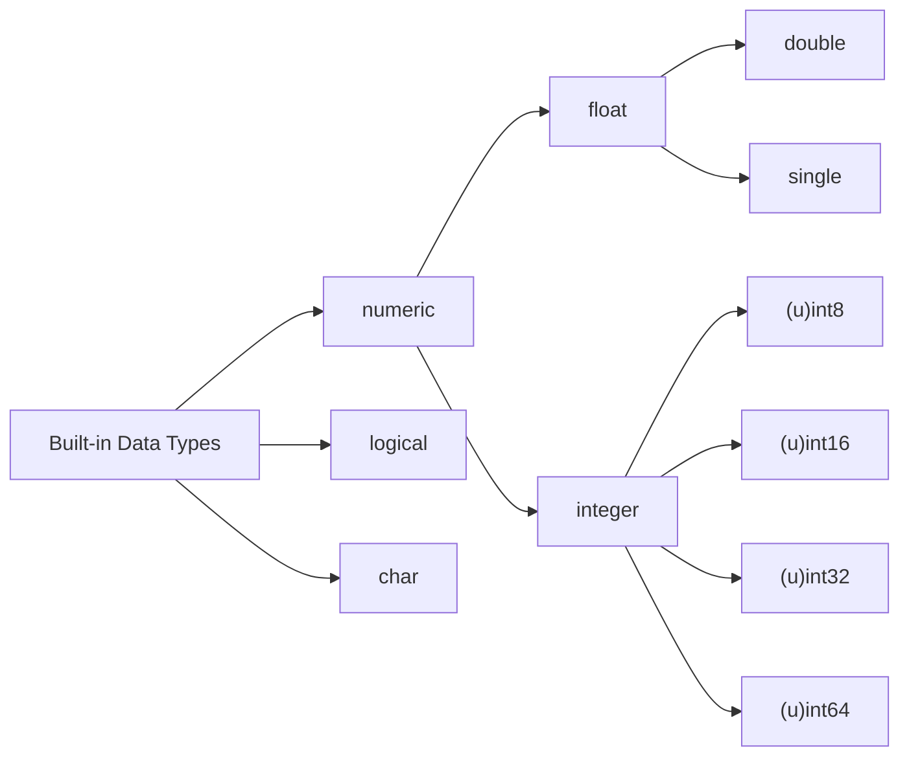

# matlab and Octave 笔记

- [matlab and Octave 笔记](#matlab-and-octave-笔记)
  - [数据类型](#数据类型)
    - [内建数据类型](#内建数据类型)
      - [判断对象类型](#判断对象类型)
      - [值类型转换](#值类型转换)
      - [类型转换](#类型转换)
      - [大小端转换](#大小端转换)
      - [最大值, 最小值, 和 相对精度值](#最大值-最小值-和-相对精度值)
      - [NA(Not Available) 值](#nanot-available-值)
      - [判断NA值](#判断na值)

## 数据类型

**: typeinfo()**

返回当前安装的所有数据类型


**: typeinfo (expr)**

返回`expr`的类型

typeinfo return| example
-|-
cell | {1, 2}
scalar | 1<br>1.0
complex scalar | i<br>j<br>1+1j
matrix | [1, 2]
diagonal matrix | eye(3)
complex matrix | [1j, 1j]
bool [matrix] | true, false
complex diagonal matrix
range | 1:10, 1:2:10
string | "abc"
sq_string | 'abc'
int8 [scalar, matrix] | int8(10)
int16 [scalar, matrix] | int16(10)
int32 [scalar, matrix] | int32(10)
int64 [scalar, matrix] | int64(10)
uint8 [scalar, matrix] | uint8(10)
uint16 [scalar, matrix] | uint16(10)
uint32 [scalar, matrix] | uint32(10)
uint64 [scalar, matrix] | uint64(10)
sparse bool matrix
sparse matrix
sparse complex matrix
struct | s.name = 'wang'; s.age = 19; <br>s = struct ()<br>s = struct (field1, value1, field2, value2, …)<br>s = struct (obj)
class
cs-list
magic-colon
built-in function
user-defined function
dynamically-linked function
function handle | f = @sin
float scalar
float complex scalar
float matrix
float diagonal matrix
float complex matrix
float complex diagonal matrix
permutation matrix
null_matrix | []
null_string | ""
null_sq_string | ''
lazy_index
onCleanup
octave_java
object

### 内建数据类型



**: classname = class (obj)**


```m
% class(obj)
>> a = 123
>> class(a)
ans = double
```
#### 判断对象类型
```m
% isa(obj, classname)
>> a = 123
>> isa(a, 'double')
ans = 1
>> isa(a, 'float')
ans = 1
>> isa(a, 'numeric')
ans = 1
```

#### 值类型转换

: `cast` (val, "type")

将val转换为type类型

```m
% type: "double", "single", "logical", "char", "int8", "int16", 
%       "int32", "int64", "uint8", "uint16", "uint32", "uint64" 

```

#### 类型转换

**: y = typecast (x, "class")**

将x在内存中值映射为class类型.

```m
>> x = uint16 ([1, 65535]);
>> typecast (x, "uint8")
ans =
    1    0  255  255
```

#### 大小端转换

**: swapbytes (x)**

```m
>> swapbytes( uint16(1:4))
ans =
   256   512   768  1024
```

#### 最大值, 最小值, 和 相对精度值

```
realmax, realmin, eps
```

#### NA(Not Available) 值


**: NA**

**: NA (n)**

**: NA (n, m)**

**: NA (n, m, k, …)**

**: NA (…, class)**   
  class: "double" or "single". 

#### 判断NA值

**: isna(x)**


