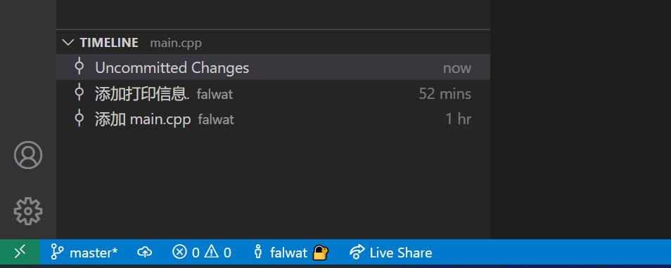
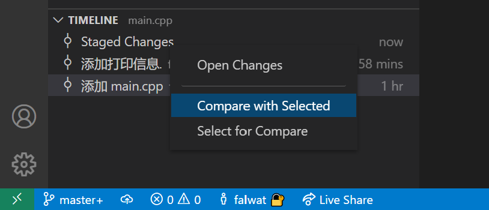

# Using Version Control in VS Code

> 参考: 
>   - [Using Version Control in VS Code](https://code.visualstudio.com/Docs/editor/versioncontrol)


## 初始化(init)

**功能:** 将文件夹初始化为git仓库(实际就是在文件夹下创建一个`.git`的隐藏文件夹) 


**方法一:**

- 使用 `code` 打开已有文件夹.
- 打开`命令面板(Ctrl+Shift+P)`, 并输入'git init', 回车.

**方法二:**

- 使用 `code` 打开已有文件夹.
- 切换至`源代码管理视图(Ctrl+Shift+G)`;
- 点击 `Initialize Repository`.

## 克隆(clone)

打开`code`.

- **方法一:** 打开`命令面板(Ctrl+Shift+P)`, 并输入'git clone', 回车. **方法二:** 切换至`源代码管理视图(Ctrl+Shift+G)`,点击 `Clone Repository`按钮;

- 将仓库的URL粘贴至命令面板输入框中;

- 选择仓库待放置的文件夹.
- 等待克隆完成.

## 提交(Commit)

为了更好的指导大家学习如何使用, 这里向仓库中添加一个源文件"main.cpp", 内容如下:

```cpp
// main.cpp
#include <iostream>

using namespace std;

int main()
{
    cout << "Hello world" << endl;
    return 0;
}
```

- 切换至`源代码管理视图(SCM, Ctrl+Shift+G)`;
- 点击文件右侧的"+",将文件的修改提交到暂存区(Stage Area);

- 点击图中的"√", 然后输入此次修改的日志信息并回车;


- 修改"main.cpp"的内容, 保存后再次提交, 可以使用上面的方式提交. 或者使用命令面板进行提交.

  - 打开`命令面板(Ctrl+Shift+P)`, 并输入"git Stage", 选择,`Git: Stage All Changes`; 

  - 打开`命令面板(Ctrl+Shift+P)`, 并输入"git ca", 选择,`Git: Commit All`
  

  - 输入此次的修改日志信息并回车.

## 版本比对

**功能:** 比对某个文件提交前后的差异,或者任意两个版本间差异.
> ***注意: 时间线分组在`资源管理器视图`中,不在`源代码管理视图`中!!!***

- 比对提交前后的差异
  - 切换至`资源管理器视图(Ctrl+Shift+E)`,在视图的下方(主界面的左下角),可以找到`时间线(TIMELINE)分组`; 
  - 点击某个版本, 即可查看此次提交文件的差异.

> ***注意: 时间线分组在`资源管理器视图`中,不在`源代码管理视图`中!!!***

  

- 比对任意两个版本间的差异
  - 选中一个版本, 在另一版本上右键, 选择"Compare with Selected",可以查看两次提交后的文件差异;

> 注意: 在`时间线`中进行版本对比的文件被设为`只读`! 所以不能修改!

- 比对中修改
  - 打开文件"main.cpp",在编辑器右侧快捷工具中点击`Open Changes`, 即可边比对边修改;


