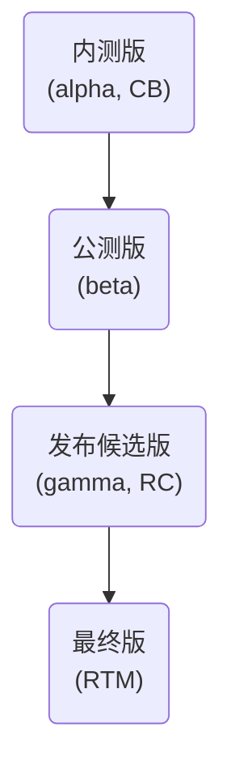

# 软件版本

- 内测版(alpha, CB)
  - 开发团队内部测试版本, 或有限用户体验测试版本
- 公测版(beta)
  - 针对所有用户公开的测试版本
- 发布候选版(gamma, RC, Release Candidate)
  - 它不是最终的版本，而是最终版之前的最后一个版本
- 最终版(RTM, Release To Manufacture)

```mermaid
graph TD
 CB("内测版<br>(alpha, CB)") --> b("公测版<br>(beta)") --> RC("发布候选版<br>(gamma, RC)") --> RTM("最终版<br>(RTM)")
```